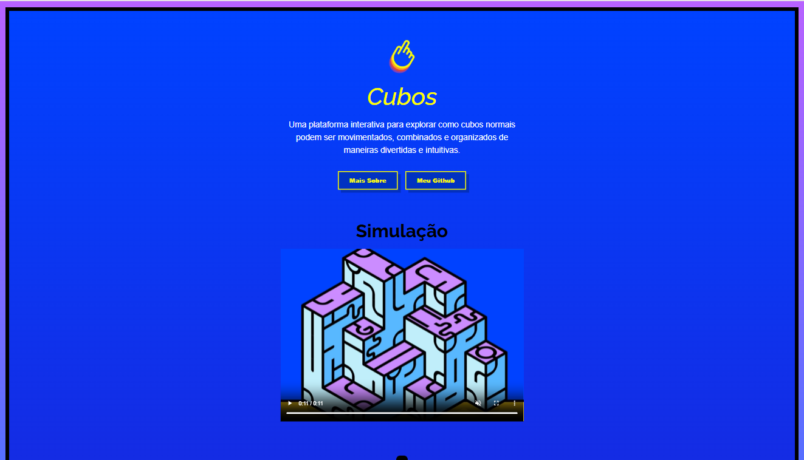

<h1 align="center">Cubos interativos - 💻</h1>

<h4 align="center"><a href="https://cubos-seven.vercel.app/">Confira o projeto aqui</a></h4>

---

## 👋 Sobre o Projeto

O **Cubos** é um site feito com **HTML e CSS** para treinar conceitos de layout, design responsivo e criatividade.  
O objetivo é simular cubos interativos e explorar efeitos visuais modernos.

---

## 🚀 Tecnologias
Este projeto foi desenvolvido com as seguintes tecnologias:

    
    

---

## 📂 Estrutura do Projeto

├── img/ # Imagens do projeto  
├── videos/ # Vídeos usados  
├── favicon.ico # Ícone do site  
├── index.html # Página inicial  
├── sobre.html # Página "Sobre"  
├── style.css # Estilos principais  
└── sobre.css # Estilos da página sobre

---

## 🌐 Deploy
Confira o projeto online clicando no link:  
👉 [Cubos - Vercel](https://cubos-seven.vercel.app/)

---

<table>
  <tr>
    <td>
      
    </td>
    <td>
      Feito por <a href="https://github.com/Arianeslf">Ariane Silvestre.</a> 🙋🏻‍♀️
    </td>
  </tr>
</table>
